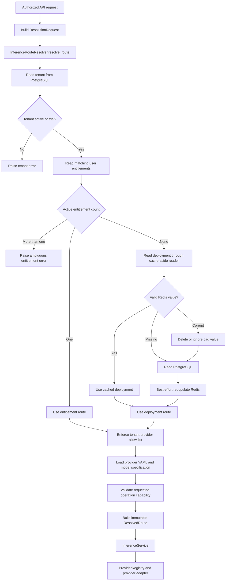

# Inference routing

This module answers one question: given an authorized tenant, user, deployment
key, and operation, which exact provider route should execute the request?

It does not authenticate users, call providers, fetch plaintext secrets, enforce
quota, or write configuration. Those concerns remain outside the module.

## Current end-to-end flow



Redis is an optimization. PostgreSQL remains authoritative. A corrupt cache
entry is ignored even if deletion fails, and a cache write failure never blocks
a valid database route.

## Decision rules

1. Missing, suspended, or deleted tenants are rejected.
2. One active user entitlement overrides the tenant deployment.
3. Multiple active entitlements are rejected as ambiguous.
4. With no active entitlement, the active tenant deployment is used.
5. The selected provider must be allowed by tenant policy.
6. The provider and model must exist in the static catalog.
7. The model must support the requested operation.

The resolver either returns one complete `ResolvedRoute` or raises a typed
domain exception. It never returns a partial route.

## Public API

```python
request = ResolutionRequest(
    tenant_id=tenant_id,
    user_id=user_id,
    deployment_key=deployment_key,
    operation=OperationType.CHAT,
    pre_authorized_entitlement_id=entitlement_id,
)

route = await route_resolver.resolve_route(request)
```

`ResolvedRoute` contains only values consumed by execution:

- tenant and deployment identity;
- provider metadata, provider name, model name, and endpoint;
- secret reference, never plaintext credentials;
- effective timeout, temperature, and token limit;
- provider-specific headers and configuration;
- quota key and deterministic route fingerprint.

## File map

| File | Responsibility |
|---|---|
| `route_resolution.py` | Precedence, policy, catalog validation, and route construction |
| `models.py` | Immutable input and output contracts |
| `contracts.py` | One reader protocol used by the resolver |
| `exceptions.py` | Routing-specific domain errors |
| `../adapters/inference_routing/cached_config_reader.py` | PostgreSQL mapping and Redis cache-aside behavior |

There is one concrete resolver and one data-reader protocol. A base class is not
needed because there are no interchangeable resolver algorithms.

## Extension guide

- Add a provider by extending provider configuration and its adapter. The route
  resolver should not change unless routing policy changes.
- Add a new operation by extending the shared operation/capability enums and
  provider model configuration.
- Change precedence only in `InferenceRouteResolver` and cover it with a
  resolver-level behavior test.
- Change persistence schemas only in the infrastructure reader's row mapping.

Keep helpers private only when they protect an internal boundary. Public
workflow names should remain descriptive and searchable.
