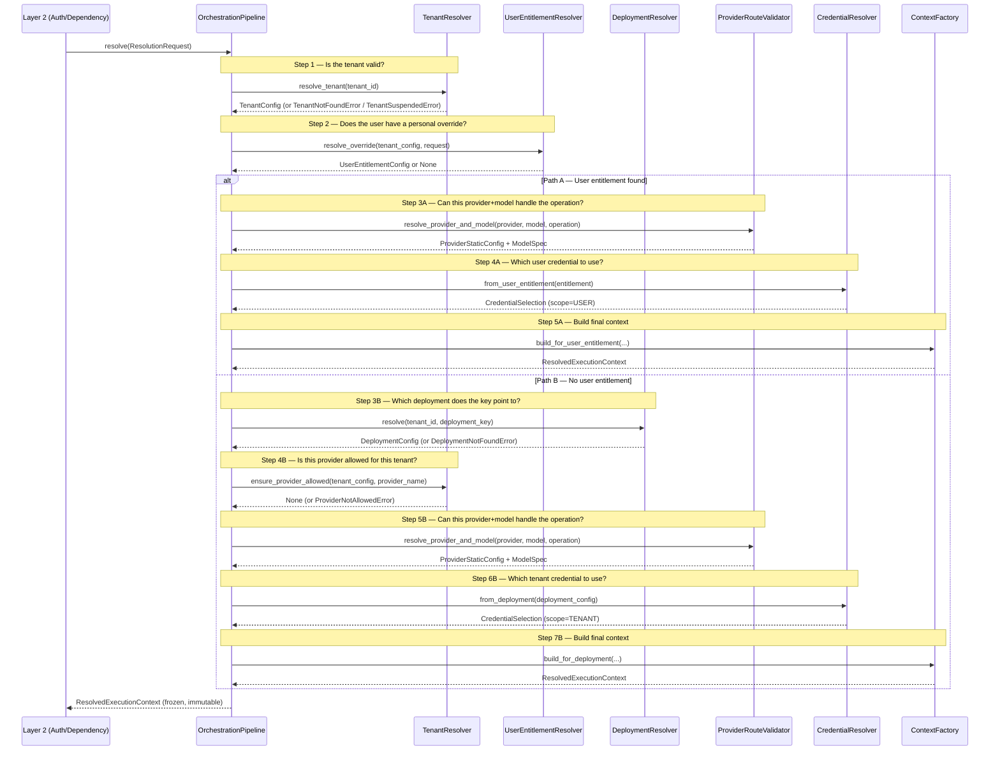

# Inference Routing — `app/inference_routing/`

> **Who this is for**: Anyone who needs to understand how an LLM request gets from an HTTP
> endpoint to an actual AI provider call. You do not need to know anything about this module
> beforehand — this document starts from zero and walks through every connection, every class,
> every design decision, and every error that can happen.

---

## Table of Contents

1. [What problem does this package solve?](#1-what-problem-does-this-package-solve)
2. [Where does it fit in the application?](#2-where-does-it-fit-in-the-application)
3. [Startup wiring — how the pipeline is assembled once](#3-startup-wiring--how-the-pipeline-is-assembled-once)
4. [Upstream — what calls into the pipeline](#4-upstream--what-calls-into-the-pipeline)
5. [Step-by-step: what happens when a request arrives](#5-step-by-step-what-happens-when-a-request-arrives)
6. [Downstream — what consumes the pipeline output](#6-downstream--what-consumes-the-pipeline-output)
7. [The complete lifecycle: HTTP in → provider call out](#7-the-complete-lifecycle-http-in--provider-call-out)
8. [Package structure — what lives in each file](#8-package-structure--what-lives-in-each-file)
9. [Class reference](#9-class-reference)
10. [Data contracts](#10-data-contracts)
11. [Exception taxonomy](#11-exception-taxonomy)
12. [Dependency rules](#12-dependency-rules)
13. [Enterprise patterns used](#13-enterprise-patterns-used)
14. [How to debug a routing failure](#14-how-to-debug-a-routing-failure)
15. [Common gotchas](#15-common-gotchas)

---

## 1. What problem does this package solve?

**The situation**: A user sends a request to `/api/v1/llm/chat` with two headers:
`X-Tenant-ID` and `X-Deployment-Key`. They want a chat completion. But between receiving
that HTTP request and actually calling OpenAI (or Anthropic, or Azure, etc.), the application
needs to answer several questions:

1. Is this tenant real and currently active? (Maybe they were suspended for non-payment.)
2. Does this user have a personal override that should be used instead of the tenant's
   default deployment?
3. Which deployment does the deployment key point to — and is that deployment currently active?
4. Is the provider (e.g., OpenAI) even allowed for this tenant?
5. Does the chosen model support the requested operation? (Not every model can do embeddings.)
6. Which API key/credential should be used — the tenant's or the user's personal one?
7. What API endpoint URL do we call?

**What this package does**: It answers all seven questions in a single `resolve()` call and
returns one frozen, read-only object that contains everything downstream code needs to make
the actual provider call. Nothing more, nothing less.

**What this package does NOT do**:

- It does **not** make HTTP calls to AI providers.
- It does **not** fetch actual passwords or API keys (only *references* to them).
- It does **not** know about HTTP status codes (it raises business-meaningful errors; another
  layer translates those to HTTP).
- It does **not** know about FastAPI, request headers, or JSON serialization.
- It does **not** know about token quota accounting (that is handled downstream in
  `InferenceService`).

Think of this package as the **routing brain**: it decides where the request should go and
with what credentials, but it never actually *sends* the request.

---

## 2. Where does it fit in the application?

When an HTTP request arrives, it flows through six layers in order:

```
┌─────────────────────────────────────────────────────────────────────────┐
│  Layer 1 — app/api/                                                     │
│  FastAPI receives the HTTP request.                                     │
│  Extracts headers: X-Tenant-ID, X-Deployment-Key.                      │
│  Validates the JWT token via get_current_user().                        │
└───────────────────────────────────┬─────────────────────────────────────┘
                                    │
                                    ▼
┌─────────────────────────────────────────────────────────────────────────┐
│  Layer 2 — app/auth/                                                    │
│  TenantAuthorizationService.authorize_inference() runs.                 │
│  Checks membership, deployment access, entitlement records.             │
│  Returns InferenceAccessContext (tenant_id, user_id,                    │
│  deployment_key, entitlement_id).                                       │
│  Results are cached in Redis (InferenceAuthorizationCache).             │
└───────────────────────────────────┬─────────────────────────────────────┘
                                    │
                                    ▼
┌─────────────────────────────────────────────────────────────────────────┐
│  Layer 3 — app/inference_routing/  ◄── THIS PACKAGE                    │
│  OrchestrationPipeline.resolve() runs.                                  │
│  Resolves: which provider, model, endpoint, credential reference.       │
│  Returns ResolvedExecutionContext (frozen, immutable).                  │
└───────────────────────────────────┬─────────────────────────────────────┘
                                    │
                                    ▼
┌─────────────────────────────────────────────────────────────────────────┐
│  Layer 4 — app/services/InferenceService                                │
│  Checks quota with TokenManagerClient.                                  │
│  Delegates to ProviderRegistry to get the right provider adapter.       │
│  Calls the provider method (generate / embed / rerank).                 │
│  Reports actual token usage back to TokenManagerClient.                 │
└───────────────────────────────────┬─────────────────────────────────────┘
                                    │
                                    ▼
┌─────────────────────────────────────────────────────────────────────────┐
│  Layer 5 — app/providers/                                               │
│  ProviderRegistry builds (or returns cached) provider adapter.          │
│  Uses context.route_fingerprint as cache key.                           │
│  Fetches the actual plaintext API key from SecretStore.                 │
│  Constructs headers and fires the outbound HTTP call.                   │
└───────────────────────────────────┬─────────────────────────────────────┘
                                    │
                                    ▼
┌─────────────────────────────────────────────────────────────────────────┐
│  Layer 6 — AI Provider (OpenAI / Anthropic / Azure / Bedrock / ...)    │
│  Returns the completion / embedding / ranking result.                   │
└─────────────────────────────────────────────────────────────────────────┘
```

**Important rule**: This package never imports from `app/api`, `app/services`, or
`app/providers`. It only depends on `app/core` (shared exceptions and config models) and
`app/infrastructure` (for `RedisCache`, used only by `DeploymentResolver`). This keeps it
reusable — you could call it from a CLI script or a batch job without pulling in the web
framework.

---

## 3. Startup wiring — how the pipeline is assembled once

The `OrchestrationPipeline` is not created per-request. It is **built once at application
startup** inside `main.py`'s `lifespan` handler and stored on `app.state`. Every request
then reads from that single shared instance.

Here is the exact wiring code from `main.py`, with annotations:

```python
# Step 1: persistence adapters — these talk to PostgreSQL via the database layer
tenant_reader     = DatabaseTenantConfigReader()      # reads from tenants table
entitlement_reader = DatabaseUserEntitlementReader()  # reads from user_entitlements
deployment_reader  = DatabaseDeploymentConfigReader() # reads from tenant_deployments

# Step 2: resolvers — each wraps an adapter and enforces business rules
tenant_resolver = TenantResolver(tenant_reader)

entitlement_resolver = UserEntitlementResolver(
    entitlement_reader=entitlement_reader,
    tenant_resolver=tenant_resolver,   # shared — entitlement resolver re-uses
)                                      # TenantResolver to check provider allow-list

# Step 3: assemble the pipeline — injects all resolvers
app.state.orchestration_pipeline = OrchestrationPipeline(
    tenant_resolver=tenant_resolver,
    entitlement_resolver=entitlement_resolver,
    deployment_resolver=DeploymentResolver(
        cache=redis_cache,                    # sub-millisecond hot path
        db_reader=deployment_reader,          # PostgreSQL fallback on cache miss
    ),
    provider_validator=ProviderRouteValidator(config_loader),  # reads YAML configs
    credential_resolver=CredentialResolver(),                  # pure logic, no I/O
    context_factory=ResolvedExecutionContextFactory(),         # pure assembly, no I/O
)
```

**Why this matters**: Because the pipeline is a singleton (shared across all requests), none
of its components may hold per-request state. Every component is stateless or holds only
startup-time configuration. Per-request data flows through method parameters only.

**What is NOT wired here**: `InferenceService` (created separately with `ProviderRegistry` +
`TokenManagerClient`) and the authorization layer (`TenantAuthorizationService`) are also
created once at startup but are independent of the routing pipeline.

---

## 4. Upstream — what calls into the pipeline

### 4.1 The dependency chain (Layer 1 → Layer 2 → Layer 3)

Every inference endpoint (`/chat`, `/embed`, `/rerank`) uses FastAPI's dependency injection
to run two things before the route handler body executes:

**Step A — Authorization** (`require_inference_access` in `dependencies.py`):

```
HTTP request arrives at /api/v1/llm/chat
    │
    ├─ FastAPI extracts headers:
    │      X-Tenant-ID      → x_tenant_id (UUID)
    │      X-Deployment-Key → x_deployment_key (str)
    │
    ├─ get_current_user() validates the JWT and returns AuthTokenPayload
    │
    └─ TenantAuthorizationService.authorize_inference(
           tenant_id=x_tenant_id,
           deployment_key=x_deployment_key,
           current_user=current_user,
       )
           │
           ├─ checks Redis authorization cache first (InferenceAuthorizationCache)
           ├─ if cache miss: queries PostgreSQL (membership, deployment access,
           │                                    entitlement records)
           └─ returns InferenceAccessContext:
                  tenant_id       → UUID of the tenant
                  user_id         → UUID of the authenticated user
                  deployment_key  → the string key from the header
                  entitlement_id  → UUID | None
                                    (None = no personal entitlement found during auth;
                                     UUID = auth layer already verified one specific entitlement)
```

**Step B — Route resolution** (`require_chat_execution_context`, built by
`_make_require_execution_context(OperationType.CHAT)`):

```python
# This is exactly what runs inside the dependency, after Step A:
await pipeline.resolve(
    ResolutionRequest(
        tenant_id=inference_context.tenant_id,
        user_id=inference_context.user_id,
        deployment_key=inference_context.deployment_key,
        operation=OperationType.CHAT,              # bound at factory time
        pre_authorized_entitlement_id=inference_context.entitlement_id,  # KEY FIELD
    )
)
```

### 4.2 Why `pre_authorized_entitlement_id` exists — the most important subtlety

The authorization layer (Layer 2) runs before routing (Layer 3). During authorization,
`TenantAuthorizationService` already queries the entitlement records. If it found one
specific active entitlement for this `(tenant_id, user_id, deployment_key)` combination,
it stores that entitlement's UUID in `InferenceAccessContext.entitlement_id`.

That UUID is then forwarded as `pre_authorized_entitlement_id` in the `ResolutionRequest`.

**Inside `UserEntitlementResolver.resolve_override()`**, when `pre_authorized_entitlement_id`
is set, it passes that ID to `entitlement_reader.find_matching_entitlements(...,
entitlement_id=entitlement_id)`. The database query then returns **only that one record**
instead of all matching entitlements.

**Why this matters**:
1. **Consistency** — The routing layer resolves the same entitlement the auth layer already
   verified. Without this pin, routing could independently pick a different entitlement if
   multiple exist, creating a mismatch between what was authorized and what gets executed.
2. **No re-query ambiguity** — Prevents `AmbiguousUserEntitlementError` from firing during
   routing for a user whose auth was already resolved to a single specific entitlement.
3. **Performance** — The database query is O(1) by primary key instead of a filtered scan.

If the auth layer found no entitlement (`entitlement_id=None`), the routing layer runs a
normal entitlement lookup and may find zero or more candidates on its own.

### 4.3 Three operation-specific dependencies, same logic

```python
# In dependencies.py — all three are produced by the same factory:
require_chat_execution_context   = _make_require_execution_context(OperationType.CHAT)
require_embed_execution_context  = _make_require_execution_context(OperationType.EMBED)
require_rerank_execution_context = _make_require_execution_context(OperationType.RERANK)
```

The only difference is the `operation` field in the `ResolutionRequest`, which the
`ProviderRouteValidator` uses to check model capability (`model.supports(CHAT)` vs
`model.supports(EMBED)` etc.).

---

## 5. Step-by-step: what happens when a request arrives

### 5.1 The big picture (sequence diagram)

This diagram shows the **order of operations** when `OrchestrationPipeline.resolve()` runs.
Each arrow is one method call. Read top to bottom.



### 5.2 The two paths explained in plain English

Every request takes one of two paths, determined at Step 2:

| Path | When it's chosen | What it means |
|---|---|---|
| **Path A — User Entitlement** | The user has a personal override for this deployment key | "This user has their own API key for this provider. Use their key and their settings instead of the tenant's." |
| **Path B — Tenant Deployment** | No user override exists | "Use the tenant's default deployment configuration and the tenant's API key." |

**Jargon explained**:
- **Entitlement**: A record that says "user X is allowed to use deployment Y on tenant Z,
  and here is the credential to use." Think of it as a personalized permission slip.
- **Deployment**: A tenant-level configuration that says "for deployment key `my-gpt4`, use
  OpenAI's `gpt-4o` model with these settings."
- **Resolution**: The process of turning abstract identifiers (tenant ID, deployment key)
  into concrete information (provider name, model name, API URL).

### 5.3 Precedence rule (which path wins?)

User entitlement **always wins over** tenant deployment — but only when all three conditions
are true:

1. The user has at least one entitlement matching `(tenant_id, user_id, deployment_key)`.
2. That entitlement is marked as active.
3. The entitlement's provider is on the tenant's allow-list.

If **zero** entitlements match → fall through to tenant deployment path (Path B).

If **more than one** entitlement matches → `AmbiguousUserEntitlementError`. This is a data
problem (someone created duplicate entitlements), not a routing problem. It means the system
cannot decide which one to use, so it refuses to guess.

### 5.4 DeploymentResolver — Redis first, PostgreSQL fallback

The `DeploymentResolver` uses a **cache-aside pattern**, not pure Redis. Here is exactly
what happens when `resolve(tenant_id, deployment_key)` is called:

```
DeploymentResolver.resolve("tenant-abc", "gpt4-production")
    │
    ├─ 1. Build Redis key:
    │       "tenant:tenant-abc:deployments:gpt4-production"
    │
    ├─ 2. Try Redis (cache.get(key)):
    │       ├─ HIT → validate JSON with DeploymentConfig.model_validate_json()
    │       │         ├─ validation error → raise ConfigurationError (corrupted cache)
    │       │         └─ success → check deployment.is_active
    │       │                       ├─ inactive → raise DeploymentInactiveError
    │       │                       └─ active → return DeploymentConfig ✓
    │       │
    │       └─ MISS → log warning "Deployment cache miss — falling back to database"
    │
    ├─ 3. Query PostgreSQL (db_reader.get_deployment_config()):
    │       ├─ None → raise DeploymentNotFoundError
    │       └─ found → check deployment.is_active
    │                   ├─ inactive → raise DeploymentInactiveError
    │                   └─ active → continue
    │
    └─ 4. Repopulate Redis (cache.set(key, deployment.model_dump_json()))
            └─ if this fails → log warning, continue anyway (non-fatal)
               (next request will hit DB again, not a hard failure)
```

**Why Redis first?** Deployment configs are read on every inference request.
Redis provides sub-millisecond reads; PostgreSQL would be 5–50× slower on the hot path.

**Why not Redis-only?** Two scenarios require the DB fallback:
- **Cold start** — Redis is empty on first deploy or after a flush.
- **Post-invalidation** — When a deployment is updated via the management API, the
  `TenantDeploymentService` invalidates (deletes) the Redis key so stale config is not
  served. The next request hits the DB, gets fresh data, and repopulates the cache.

### 5.5 Concrete end-to-end worked example

**Scenario**: Tenant `acme-corp` has a deployment key `gpt4-prod` pointing to OpenAI
`gpt-4o`. User `alice` has no personal entitlement. She sends a chat request.

```
Request headers:
    X-Tenant-ID:     550e8400-e29b-41d4-a716-446655440000   (acme-corp)
    X-Deployment-Key: gpt4-prod
    Authorization:   Bearer <alice's JWT>

Step A — Auth layer:
    authorize_inference(tenant_id=acme-corp, deployment_key=gpt4-prod, user=alice)
    → checks Redis auth cache: MISS
    → queries DB: alice IS a member of acme-corp, gpt4-prod IS an active deployment,
                  alice has NO personal entitlement for gpt4-prod
    → caches result
    → returns InferenceAccessContext(
            tenant_id=acme-corp,
            user_id=alice-uuid,
            deployment_key="gpt4-prod",
            entitlement_id=None,          ← no personal entitlement
       )

Step B — Routing layer:
    pipeline.resolve(ResolutionRequest(
        tenant_id=acme-corp,
        user_id=alice-uuid,
        deployment_key="gpt4-prod",
        operation=CHAT,
        pre_authorized_entitlement_id=None,
    ))

    Step 1 — TenantResolver.resolve_tenant(acme-corp):
        → queries DatabaseTenantConfigReader → PostgreSQL
        → acme-corp exists, status=active
        → returns TenantConfig(allowed_providers={"openai", "anthropic"}, ...)

    Step 2 — UserEntitlementResolver.resolve_override(...):
        → entitlement_reader.find_matching_entitlements(
              tenant_id=acme-corp, user_id=alice, deployment_key="gpt4-prod",
              entitlement_id=None,   ← no pin, full search
          )
        → returns []  (no entitlements)
        → active_candidates = []
        → returns None   ← PATH B chosen

    Step 3B — DeploymentResolver.resolve(acme-corp, "gpt4-prod"):
        → cache.get("tenant:acme-corp:deployments:gpt4-prod")
        → Redis HIT → validates JSON → deployment.is_active=True
        → returns DeploymentConfig(provider_name="openai", model_name="gpt-4o",
                                   api_endpoint_url="https://api.openai.com/v1",
                                   secret_reference="ACME_OPENAI_KEY", ...)

    Step 4B — TenantResolver.ensure_provider_allowed(tenant_config, "openai"):
        → tenant_config.allowed_providers = {"openai", "anthropic"}
        → "openai" IS in the set → no error ✓

    Step 5B — ProviderRouteValidator.resolve_provider_and_model("openai","gpt-4o",CHAT):
        → loads openai.yaml from ConfigLoader
        → finds model_spec for "gpt-4o"
        → checks model_spec.supports(ModelCapability.CHAT) → True ✓
        → returns (ProviderStaticConfig, LLMModelSpec)

    Step 6B — CredentialResolver.from_deployment(deployment):
        → returns CredentialSelection(
               credential_scope=TENANT,
               secret_reference="ACME_OPENAI_KEY",
               api_endpoint_url="https://api.openai.com/v1",
               cloud_region=None,
          )

    Step 7B — ResolvedExecutionContextFactory.build_for_deployment(...):
        → computes route_fingerprint = SHA256({
               resolution_source: "tenant_deployment",
               tenant_id: "acme-corp-uuid",
               provider_name: "openai",
               model_name: "gpt-4o",
               api_endpoint_url: "https://api.openai.com/v1",
               cloud_region: None,
               credential_scope: "tenant",
               secret_reference: "ACME_OPENAI_KEY",
               deployment_key: "gpt4-prod",
          })
        → returns ResolvedExecutionContext(
               provider_name="openai",
               model_name="gpt-4o",
               api_endpoint_url="https://api.openai.com/v1",
               secret_reference="ACME_OPENAI_KEY",
               credential_scope=TENANT,
               quota_key="gpt4-prod",              ← deployment_key for Path B
               route_fingerprint="a3f7b2...",       ← used downstream for caching
               effective_timeout_seconds=30.0,
               effective_max_retries=3,
               ...
          )
```

---

## 6. Downstream — what consumes the pipeline output

The `ResolvedExecutionContext` returned by the pipeline is used by two downstream components:

### 6.1 InferenceService — quota enforcement and provider dispatch

`InferenceService` receives the context as a parameter and uses specific fields:

```
InferenceService.execute_chat(context, request)
    │
    ├─ 1. Quota check:
    │       token_manager.check_quota(
    │           context.tenant_config.tenant_id,
    │           context.quota_key,    ← "gpt4-prod" (Path B) or entitlement UUID (Path A)
    │           request,
    │       )
    │       Raises QuotaExceededError if tenant has used their allowance.
    │
    ├─ 2. Provider lookup:
    │       provider = await registry.get_provider(context)
    │       Uses context.route_fingerprint as the registry cache key.
    │
    ├─ 3. Provider call:
    │       response = await provider.generate(request)
    │
    └─ 4. Usage reporting:
            token_manager.report_usage(
                context.tenant_config.tenant_id,
                context.quota_key,
                response.usage.prompt_tokens,
                response.usage.completion_tokens,
            )
```

**`quota_key` differs by path**:
- Path A (user entitlement): `str(user_entitlement_config.entitlement_id)` — quota is
  tracked per individual entitlement. Each user's entitlement has its own counter.
- Path B (tenant deployment): `deployment_config.deployment_key` — quota is tracked
  per deployment. All users sharing the same deployment share the same quota bucket.

### 6.2 ProviderRegistry — route fingerprint as provider cache key

```
ProviderRegistry.get_provider(context)
    │
    ├─ cache_key = context.route_fingerprint
    │   (a SHA-256 hash of provider+model+endpoint+credential+scope+tenant)
    │
    ├─ Fast path (no lock): if cache_key in self._providers → return cached provider
    │
    └─ Slow path (double-checked lock):
           1. Fetch plaintext API key:
                  secret_store.get_secret(
                      context.secret_reference,   ← "ACME_OPENAI_KEY"
                      tenant_id=str(context.tenant_config.tenant_id),
                  )
                  Returns the real API key from Vault or env var.
                  This is the FIRST moment the plaintext key exists in memory.
           2. Build provider instance:
                  Dynamically imports the right provider class (e.g., OpenAIProvider)
                  Passes api_key, endpoint_url, timeout, circuit_breaker, etc.
           3. Caches it: self._providers[cache_key] = provider
           4. Returns provider
```

**Why `route_fingerprint` is the cache key**: The fingerprint uniquely identifies the
combination of provider + model + API endpoint + credential reference + credential scope
+ tenant. If any of those change (e.g., a new secret is registered, or the deployment's
model is updated), a different fingerprint is computed, forcing a new provider instance.
This is why updating a deployment requires a Redis cache invalidation — the next request
gets a fresh `DeploymentConfig` from the DB, computes a new fingerprint, and the old
provider instance is never reused.

### 6.3 Where the plaintext API key FIRST appears

```
Request lifecycle from the security lens:
    
    app/api         → knows tenant_id, deployment_key, user_id (no credentials)
    app/auth        → knows whether the user is authorized (no credentials)
    app/inference_routing → knows secret_reference only (pointer, not value)
    app/services    → passes secret_reference through to registry (no credentials)
    app/providers   → ProviderRegistry calls SecretStore.get_secret() HERE
                      Plaintext key exists in memory only for the duration of the
                      outbound HTTP call. Never logged, never persisted.
```

This boundary is deliberate. If the routing or service layer is compromised, the attacker
gets credential references (strings like `"ACME_OPENAI_KEY"`) — useless without access to
the secret store. The plaintext key is materialized as late as possible, in the narrowest
possible scope.

---

## 7. The complete lifecycle: HTTP in → provider call out

```
┌─────────────────────────────────────────────────────────────────────┐
│ INCOMING REQUEST                                                     │
│ POST /api/v1/llm/chat                                               │
│ Headers: X-Tenant-ID, X-Deployment-Key, Authorization: Bearer <JWT> │
└──────────────────────────────┬──────────────────────────────────────┘
                               │
                               ▼
                   ┌───────────────────────┐
                   │ attach_request_id()   │  middleware in main.py
                   │ Reads X-Request-ID    │  assigns correlation ID
                   │ header or generates   │  echoed back in response
                   │ a new UUID4           │
                   └───────────┬───────────┘
                               │
                               ▼
                   ┌───────────────────────┐
                   │ get_current_user()    │  FastAPI dependency
                   │ Validates JWT,        │  Returns AuthTokenPayload
                   │ returns user payload  │  (user_id, roles, ...)
                   └───────────┬───────────┘
                               │
                               ▼
                   ┌───────────────────────┐
                   │ require_inference_    │  FastAPI dependency
                   │ access()             │  Calls TenantAuthorizationService
                   │                      │  Checks Redis auth cache first
                   │                      │  Falls back to PostgreSQL
                   │                      │  Returns InferenceAccessContext
                   └───────────┬───────────┘
                               │
              ┌────────────────┴───────────────┐
              │ InferenceAccessContext          │
              │   tenant_id                    │
              │   user_id                      │
              │   deployment_key               │
              │   entitlement_id (UUID|None)   │
              └────────────────┬───────────────┘
                               │
                               ▼
                   ┌───────────────────────┐
                   │ pipeline.resolve()    │  OrchestrationPipeline
                   │ Builds ResolutionRequest and calls each resolver in order
                   │ Returns ResolvedExecutionContext (frozen)
                   └───────────┬───────────┘
                               │
              ┌────────────────┴───────────────────────────────────┐
              │ ResolvedExecutionContext                            │
              │   provider_name, model_name, api_endpoint_url      │
              │   secret_reference  (pointer — NOT the key)        │
              │   credential_scope (USER | TENANT)                 │
              │   quota_key                                        │
              │   route_fingerprint (SHA-256)                      │
              │   effective_timeout, max_retries, temperature, ... │
              └────────────────┬───────────────────────────────────┘
                               │
                               ▼
                   ┌───────────────────────┐
                   │ InferenceService      │
                   │ 1. check_quota()      │  TokenManagerClient
                   │ 2. get_provider()     │  ProviderRegistry (fingerprint key)
                   │ 3. provider.generate()│  OpenAIProvider / AnthropicProvider / ...
                   │ 4. report_usage()     │  TokenManagerClient
                   └───────────┬───────────┘
                               │
                               ▼
                   ┌───────────────────────┐
                   │ ProviderRegistry      │
                   │ Fetches plaintext key │  SecretStore.get_secret(secret_reference)
                   │ Builds provider once  │  Cached by route_fingerprint
                   │ Returns adapter       │
                   └───────────┬───────────┘
                               │
                               ▼
                   ┌───────────────────────┐
                   │ AI Provider           │
                   │ OpenAI / Anthropic /  │
                   │ Azure / Bedrock / ... │
                   └───────────┬───────────┘
                               │
                               ▼
                   ┌───────────────────────┐
                   │ ChatResponse /        │
                   │ EmbedResponse /       │
                   │ RerankResponse        │
                   └───────────────────────┘
```

---

## 8. Package structure — what lives in each file

```
app/inference_routing/
│
├── __init__.py                   # Re-exports everything under one clean import path
│
├── pipeline.py                   # OrchestrationPipeline — the single entry point
│                                 # owns the order of steps, nothing else
│
├── tenant_resolver.py            # TenantResolver
│                                 # "is this tenant real and active?"
│                                 # "is this provider on the allow-list?"
│
├── entitlement_resolver.py       # UserEntitlementResolver
│                                 # "does the user have a personal override?"
│                                 # enforces: active-only, exactly-one, provider-allowed
│
├── deployment_resolver.py        # DeploymentResolver
│                                 # "what deployment does this key point to?"
│                                 # cache-aside: Redis → PostgreSQL → re-populate Redis
│
├── provider_validator.py         # ProviderRouteValidator
│                                 # "is this provider configured in YAML?"
│                                 # "does this model exist?"
│                                 # "can this model do chat/embed/rerank?"
│                                 # synchronous — reads from in-memory YAML config only
│
├── credential_resolver.py        # CredentialResolver
│                                 # "which credential reference to use (USER vs TENANT)?"
│                                 # pure logic, no I/O — returns pointer, not the key
│
├── context_factory.py            # ResolvedExecutionContextFactory
│                                 # assembles the final frozen context from all resolved pieces
│                                 # computes route_fingerprint (SHA-256)
│                                 # applies parameter precedence (deployment config → provider default)
│
├── models.py                     # ResolutionRequest, ResolvedExecutionContext, enums
│                                 # ResolutionSource (USER_ENTITLEMENT | TENANT_DEPLOYMENT)
│                                 # CredentialScope (USER | TENANT)
│
├── contracts.py                  # Protocol interfaces for data readers
│                                 # TenantConfigReader, DeploymentConfigReader, UserEntitlementReader
│                                 # resolvers depend on these, not on concrete DB classes
│
├── persistence_adapters.py       # Concrete implementations of contracts.py interfaces
│                                 # DatabaseTenantConfigReader → TenantPersistence (SQL)
│                                 # DatabaseDeploymentConfigReader → TenantDeploymentPersistence (SQL)
│                                 # DatabaseUserEntitlementReader → UserEntitlementPersistence (SQL)
│                                 # Also contains private _row_to_*() row-to-domain converters
│
└── exceptions.py                 # Routing-specific domain errors
                                  # ResolutionError (base)
                                  # ProviderNotAllowedError, OperationNotSupportedError,
                                  # AmbiguousUserEntitlementError
```

Each file has **one clear job**. If you need to change how deployments are resolved, you only
touch `deployment_resolver.py`. If you need to add a new routing error, you only touch
`exceptions.py`. If you need to add a new data reader (e.g., one that reads from a config
service instead of PostgreSQL), you implement the interface in `contracts.py` without touching
any resolver.

---

## 9. Class reference

### 9.1 `OrchestrationPipeline` — `pipeline.py`

**What it does**: The single entry point. Call `resolve()` with a `ResolutionRequest` and get
back a `ResolvedExecutionContext`. It owns the order of operations — no other class knows what
step comes next.

**Constructor dependencies** (all injected, one per step):

| Dependency | Job |
|---|---|
| `TenantResolver` | Step 1 — validate tenant |
| `UserEntitlementResolver` | Step 2 — check for user override |
| `DeploymentResolver` | Step 3B — resolve deployment (cache-aside) |
| `ProviderRouteValidator` | Step 3A/5B — validate provider+model+operation |
| `CredentialResolver` | Step 4A/6B — select credential reference |
| `ResolvedExecutionContextFactory` | Final step — assemble the result |

```python
class OrchestrationPipeline:
    def __init__(
        self,
        tenant_resolver: TenantResolver,
        entitlement_resolver: UserEntitlementResolver,
        deployment_resolver: DeploymentResolver,
        provider_validator: ProviderRouteValidator,
        credential_resolver: CredentialResolver,
        context_factory: ResolvedExecutionContextFactory,
    ) -> None: ...

    async def resolve(self, request: ResolutionRequest) -> ResolvedExecutionContext: ...
```

**Wiring**: Created once at application startup and stored on `app.state`. All requests share
the same pipeline instance (it holds no per-request state). Retrieved per-request via
`get_orchestration_pipeline(request)` in `dependencies.py`.

---

### 9.2 `TenantResolver` — `tenant_resolver.py`

**What it does**: Answers two questions: (1) does this tenant exist and is it active?
(2) is this provider on the tenant's allow-list?

```python
class TenantResolver:
    def __init__(self, tenant_reader: TenantConfigReader) -> None: ...

    async def resolve_tenant(self, tenant_id: UUID | str) -> TenantConfig: ...
    # Raises: TenantNotFoundError (tenant doesn't exist)
    #         TenantSuspendedError (tenant exists but is suspended)

    @staticmethod
    def ensure_provider_allowed(tenant_config: TenantConfig, provider_name: str) -> None: ...
    # Raises: ProviderNotAllowedError (provider not on tenant's allow-list)
```

`ensure_provider_allowed` is a **static method** — no database calls, no network I/O. The
allow-list is already loaded in the `TenantConfig` object, so this check is instant. It is
called **twice** in Path A: once by `UserEntitlementResolver` (to validate that the user's
personal entitlement points to an allowed provider), and once in Path B before the deployment
validator runs.

---

### 9.3 `DeploymentResolver` — `deployment_resolver.py`

**What it does**: Resolves a deployment configuration using a cache-aside strategy: Redis
first, PostgreSQL fallback, then re-populates Redis. Also enforces that the deployment is
active.

```python
class DeploymentResolver:
    def __init__(self, cache: RedisCache, db_reader: DeploymentConfigReader) -> None: ...

    async def resolve(self, tenant_id: UUID | str, deployment_key: str) -> DeploymentConfig: ...
    # Raises: DeploymentNotFoundError (key absent from both Redis and PostgreSQL)
    #         DeploymentInactiveError (deployment exists but is not active)
    #         ConfigurationError (cached JSON is corrupted / fails Pydantic validation)
```

**Redis key format**: `tenant:{tenant_id}:deployments:{deployment_key}`

**Cache repopulation on miss**: After a successful PostgreSQL read, the result is serialized
to JSON via `deployment.model_dump_json()` and stored in Redis. If that Redis write fails
(e.g., Redis is temporarily unavailable), the failure is logged as a warning and the
DeploymentConfig from PostgreSQL is returned anyway — inference continues at slightly higher
latency until the next Redis write succeeds.

---

### 9.4 `UserEntitlementResolver` — `entitlement_resolver.py`

**What it does**: Checks whether the authenticated user has a personal entitlement (override)
for this deployment key. If yes, validates it and returns the entitlement config. If no,
returns `None` so the pipeline falls through to the tenant deployment path.

```python
class UserEntitlementResolver:
    def __init__(
        self,
        entitlement_reader: UserEntitlementReader,
        tenant_resolver: TenantResolver,
    ) -> None: ...

    async def resolve_override(
        self,
        tenant_config: TenantConfig,
        request: ResolutionRequest,
    ) -> UserEntitlementConfig | None: ...
    # Returns None → no override, use tenant deployment path (Path B)
    # Returns one → user entitlement path wins (Path A)
    # Raises AmbiguousUserEntitlementError → more than one active match (data problem)
```

**Active-only filtering**: The DB query returns all matching entitlement records. This resolver
then filters to `[c for c in candidates if c.is_active]`. Inactive entitlements are silently
skipped — their existence does not cause an error.

**Why `TenantResolver` is injected here**: After finding an active entitlement, the resolver
calls `tenant_resolver.ensure_provider_allowed(tenant_config, entitlement.provider_name)`.
This guarantees that even user-specific entitlements cannot bypass tenant-level provider
restrictions.

---

### 9.5 `ProviderRouteValidator` — `provider_validator.py`

**What it does**: Checks three things against the static YAML provider catalog: (1) is this
provider configured? (2) does this model exist under this provider? (3) can this model handle
the requested operation (chat/embed/rerank)?

```python
class ProviderRouteValidator:
    def __init__(self, config_loader: ConfigLoader) -> None: ...

    def resolve_provider_and_model(
        self,
        provider_name: str,
        model_name: str,
        operation: OperationType,
    ) -> tuple[ProviderStaticConfig, LLMModelSpec]: ...
    # Raises: ConfigurationError (provider YAML not found)
    #         ModelNotSupportedError (model not in provider's catalog)
    #         OperationNotSupportedError (model can't do this operation)
```

**This is the only synchronous class in the pipeline.** The YAML catalog is loaded into memory
at startup via `ConfigLoader` — no I/O happens per request. This method is a pure in-memory
lookup.

**How `OperationType` maps to `ModelCapability`**: The validator has a private mapping:

```python
{
    OperationType.CHAT:   ModelCapability.CHAT,
    OperationType.EMBED:  ModelCapability.EMBED,
    OperationType.RERANK: ModelCapability.RERANK,
}
```

`model_spec.supports(capability)` then checks the model's capability flags loaded from YAML.

---

### 9.6 `CredentialResolver` — `credential_resolver.py`

**What it does**: Selects the right credential reference. Important: it returns a
**reference** (like a key name or Vault path), never the actual API key or password. The
actual secret retrieval happens later, in `ProviderRegistry`, right before the outbound
API call.

```python
class CredentialResolver:
    @staticmethod
    def from_user_entitlement(entitlement: UserEntitlementConfig) -> CredentialSelection: ...
    # Returns CredentialSelection(scope=USER, ...)

    @staticmethod
    def from_deployment(deployment: DeploymentConfig) -> CredentialSelection: ...
    # Returns CredentialSelection(scope=TENANT, ...)
```

**Why separate credential fetching from routing?** Security. If routing code is ever
compromised, the attacker gets credential references (useless without the secret store), not
actual API keys. The blast radius is limited. See Section 6.3 for the full security boundary
analysis.

**Why `CredentialSelection` is a `NamedTuple` and not a Pydantic model**: It is an internal
pipeline-only data carrier, never serialized or validated from external input. `NamedTuple`
is lighter and communicates "this is not a public contract, just structured local data."

---

### 9.7 `ResolvedExecutionContextFactory` — `context_factory.py`

**What it does**: Takes all the resolved pieces (tenant config, provider config, model spec,
credential selection) and assembles them into one frozen, immutable `ResolvedExecutionContext`.
Also computes the route fingerprint.

```python
class ResolvedExecutionContextFactory:
    def build_for_deployment(self, *, tenant_config, deployment_config,
        provider_static_config, model_spec, credential_selection,
    ) -> ResolvedExecutionContext: ...

    def build_for_user_entitlement(self, *, tenant_config, user_entitlement_config,
        provider_static_config, model_spec, credential_selection,
    ) -> ResolvedExecutionContext: ...
```

**How `route_fingerprint` is computed**:

```python
payload = {
    "resolution_source": "tenant_deployment" | "user_entitlement",
    "tenant_id": str(tenant_config.tenant_id),
    "provider_name": ...,
    "model_name": ...,
    "api_endpoint_url": ...,
    "cloud_region": ...,
    "credential_scope": "user" | "tenant",
    "secret_reference": ...,
    "deployment_key": ...,    # Path B only
    "entitlement_id": ...,    # Path A only
}
normalized = json.dumps(payload, sort_keys=True, separators=(",", ":"))
fingerprint = hashlib.sha256(normalized.encode("utf-8")).hexdigest()
```

The sort_keys and compact separators guarantee that the same logical route always produces
the same fingerprint regardless of insertion order. This fingerprint is then used as:
- Cache key in `ProviderRegistry` to avoid rebuilding providers on every request.
- (Potentially) cache key in `InferenceAuthorizationCache` for auth caching.

**Parameter precedence** (which value wins when there are two sources):

| Parameter | Path B source | Fallback |
|---|---|---|
| Timeout (seconds) | `deployment_config.timeout_seconds` | `provider_static_config.default_timeout_seconds` |
| Max retries | `deployment_config.max_retries` | `provider_static_config.default_max_retries` |
| Temperature | `deployment_config.default_temperature` | *(required — always present on deployment)* |
| Max output tokens | `deployment_config.default_max_tokens` | `model_spec.max_output_tokens` |

For **Path A** (user entitlement), most effective parameters come from provider defaults since
entitlements do not carry per-request limits. `effective_temperature` uses the provider
default, and `effective_max_tokens` uses the model's max.

---

### 9.8 Persistence Adapters — `persistence_adapters.py`

**What it does**: Provides concrete implementations of the three reader protocols in
`contracts.py`. Each adapter wraps one database persistence class and converts raw
PostgreSQL row dicts into domain model objects.

```python
class DatabaseTenantConfigReader:     # implements TenantConfigReader
    def __init__(self, persistence: TenantPersistence | None = None) -> None: ...
    async def get_tenant_config(self, tenant_id: UUID | str) -> TenantConfig | None: ...

class DatabaseDeploymentConfigReader:  # implements DeploymentConfigReader
    def __init__(self, persistence: TenantDeploymentPersistence | None = None) -> None: ...
    async def get_deployment_config(self, tenant_id, deployment_key) -> DeploymentConfig | None: ...

class DatabaseUserEntitlementReader:   # implements UserEntitlementReader
    def __init__(self, persistence: UserEntitlementPersistence | None = None) -> None: ...
    async def find_matching_entitlements(self, ...) -> list[UserEntitlementConfig]: ...
```

**Private row converters** (`_row_to_*` functions): Each adapter delegates mapping from
raw DB dict to domain model to a private module-level function. For example,
`_row_to_deployment_config(row)` handles nullable fields like `timeout_seconds`,
`max_retries`, and `cloud_region` with safe `row.get(...)` calls, and converts enums like
`DeploymentStatus` and boolean flags like `is_default`.

**No SQL here**: All SQL lives in `app/database/`. These adapters only call persistence
methods and convert the returned dicts. This is the single authorised SQL execution boundary.

---

## 10. Data contracts

### 10.1 `ResolutionRequest` — `models.py`

The input to the pipeline. Created from the `InferenceAccessContext` returned by the auth
layer.

| Field | Type | What it means |
|---|---|---|
| `tenant_id` | `UUID` | Which tenant is making this request (from `X-Tenant-ID` header) |
| `user_id` | `UUID` | Which user is authenticated (from JWT) |
| `deployment_key` | `str` | Which deployment to route to (from `X-Deployment-Key` header) |
| `operation` | `OperationType` | What kind of AI task: `CHAT`, `EMBED`, or `RERANK` |
| `pre_authorized_entitlement_id` | `UUID \| None` | If the auth layer already found and verified one specific entitlement, its ID is pinned here so routing resolves the same one. `None` means full search. |
| `requested_model_name` | `str \| None` | Optional hint for entitlement matching when multiple entitlements differ by model. |
| `token_request_id` | `str \| None` | Correlation ID from the token manager for quota pre-authorization. Passed through for tracing; not used by routing logic. |
| `trace_id` | `str \| None` | Distributed trace identifier for cross-service correlation. Passed through; not used by routing logic. |

This model is **frozen** (immutable) — once created, it cannot be changed. This prevents bugs
where one part of the pipeline accidentally modifies the input that another part depends on.

---

### 10.2 `ResolvedExecutionContext` — `models.py`

The output of the pipeline. The provider layer reads this to make the actual AI provider call.

| Field | Type | What it tells the downstream layer |
|---|---|---|
| `provider_name` | `str` | e.g., `"openai"` — used by ProviderRegistry to select the adapter class |
| `model_name` | `str` | e.g., `"gpt-4o"` — passed to the provider for the API call |
| `api_endpoint_url` | `str` | The full URL to POST to |
| `secret_reference` | `str` | Which credential to look up in SecretStore — **not the key itself** |
| `credential_scope` | `USER` or `TENANT` | Whose credential to use; recorded for audit logging |
| `resolution_source` | `USER_ENTITLEMENT` or `TENANT_DEPLOYMENT` | Which path won — useful for debugging |
| `quota_key` | `str` | Used by InferenceService for quota check and usage reporting. Path A: entitlement UUID. Path B: deployment_key. |
| `route_fingerprint` | `str` | SHA-256 of the resolved route. Used as cache key in ProviderRegistry. Same inputs → same fingerprint → same cached provider reused. |
| `effective_timeout_seconds` | `float` | How long to wait for the provider before giving up |
| `effective_max_retries` | `int` | How many times to retry on transient failure |
| `effective_temperature` | `float` | Creativity level passed to the model |
| `effective_max_tokens` | `int` | Max tokens the model can output |
| `extra_headers` | `dict[str, str]` | Deployment-level HTTP headers merged into every outbound request (e.g., Azure API version headers) |
| `extra_config` | `dict[str, object]` | Provider-specific options (e.g., `azure_deployment_name`, `aws_region` for Bedrock) |
| `cloud_region` | `str \| None` | Cloud region for region-specific providers (Bedrock, Azure) |
| `tenant_config` | `TenantConfig` | Full tenant config — `InferenceService` reads `tenant_id` from here for quota accounting |
| `deployment_config` | `DeploymentConfig \| None` | Present on Path B, `None` on Path A |
| `user_entitlement_config` | `UserEntitlementConfig \| None` | Present on Path A, `None` on Path B |
| `provider_static_config` | `ProviderStaticConfig` | Full provider YAML config — contains defaults used for fallback parameters |
| `model_spec` | `LLMModelSpec` | Full model spec from YAML — contains capability flags and `max_output_tokens` |

This model is also **frozen**. Once the pipeline produces it, nothing downstream can
accidentally change it. Frozen Pydantic models raise `ValidationError` on any attribute
assignment attempt.

---

### 10.3 `CredentialSelection` — `credential_resolver.py`

A lightweight `NamedTuple` (not a full Pydantic model) used only inside the pipeline as a
transient intermediate result.

| Field | Type | Meaning |
|---|---|---|
| `credential_scope` | `USER` or `TENANT` | Whose credential |
| `secret_reference` | `str` | Opaque pointer into the secret store |
| `api_endpoint_url` | `str` | Provider's API URL |
| `cloud_region` | `str \| None` | Cloud region (for Bedrock, Azure) |

---

### 10.4 Reader Protocols — `contracts.py`

Three interfaces (Python `Protocol` classes) that define how resolvers read data
**without knowing where the data lives**.

```python
class TenantConfigReader(Protocol):
    async def get_tenant_config(self, tenant_id: UUID | str) -> TenantConfig | None: ...

class DeploymentConfigReader(Protocol):
    async def get_deployment_config(
        self, tenant_id: UUID | str, deployment_key: str
    ) -> DeploymentConfig | None: ...

class UserEntitlementReader(Protocol):
    async def find_matching_entitlements(
        self, tenant_id, user_id, deployment_key, requested_model_name=None,
        entitlement_id=None,
    ) -> list[UserEntitlementConfig]: ...
```

**Why Protocols instead of concrete classes?** A `Protocol` says "I need something that has
a `get_tenant_config` method" — it does not care whether that method reads from Redis,
PostgreSQL, or a test mock. This means:

- Resolvers can be tested with simple in-memory stubs (no Redis, no PostgreSQL in tests).
- The storage backend can be swapped (e.g., from PostgreSQL to a gRPC config service) without
  changing any resolver code.
- The dependency direction is inverted: the resolver defines what it needs; the storage layer
  fulfills that contract.

---

## 11. Exception taxonomy

### 11.1 Exception inheritance chain

```
Exception (Python built-in)
└── LLMServiceError          (app/core/exceptions.py)  — base for all domain errors
    └── ResolutionError      (exceptions.py)            — base for routing errors
        ├── ProviderNotAllowedError
        ├── OperationNotSupportedError
        └── AmbiguousUserEntitlementError
```

Errors defined in `app/core/exceptions.py` and re-used by this package:

```
LLMServiceError
├── TenantNotFoundError       — raised by TenantResolver
├── TenantSuspendedError      — raised by TenantResolver
├── DeploymentNotFoundError   — raised by DeploymentResolver
├── DeploymentInactiveError   — raised by DeploymentResolver
├── ConfigurationError        — raised by DeploymentResolver, ProviderRouteValidator
└── ModelNotSupportedError    — raised by ProviderRouteValidator
```

### 11.2 Errors raised by this package

| Exception | Meaning | Raised by |
|---|---|---|
| `ProviderNotAllowedError` | This tenant is not allowed to use this provider | `TenantResolver.ensure_provider_allowed()` |
| `OperationNotSupportedError` | This model cannot do chat/embed/rerank | `ProviderRouteValidator` |
| `AmbiguousUserEntitlementError` | User has multiple active entitlements for this route (data problem, not a user error) | `UserEntitlementResolver` |

### 11.3 Errors re-used from `app/core/exceptions.py`

| Exception | Meaning | Raised by |
|---|---|---|
| `TenantNotFoundError` | Tenant ID does not exist in the database | `TenantResolver` |
| `TenantSuspendedError` | Tenant exists but has been suspended | `TenantResolver` |
| `DeploymentNotFoundError` | Deployment key not found in Redis or PostgreSQL | `DeploymentResolver` |
| `DeploymentInactiveError` | Deployment exists but is not active | `DeploymentResolver` |
| `ConfigurationError` | Provider YAML missing, or Redis-cached JSON failed Pydantic validation | `DeploymentResolver`, `ProviderRouteValidator` |
| `ModelNotSupportedError` | Model name not found in the provider's YAML catalog | `ProviderRouteValidator` |

### 11.4 Who translates errors to HTTP status codes?

**Nobody in this package.** All errors propagate upward. The translation happens in two places:

1. `app/api/dependencies.py` — `_make_require_execution_context` catches `LLMServiceError`
   and calls `translate_inference_error(exc)`.
2. `app/api/exception_handlers.py` — owns the single mapping from error type → HTTP status
   code. For example: `TenantNotFoundError → 404`, `ProviderNotAllowedError → 403`,
   `AmbiguousUserEntitlementError → 409`.

This package has zero knowledge of HTTP. It only raises business-meaningful errors.

---

## 12. Dependency rules

What this package is **allowed** to import:

```
app/inference_routing/  may import from:
    app/core/            — shared exceptions, config models, domain enums
    app/schemas/         — OperationType enum
    app/infrastructure/  — RedisCache (only DeploymentResolver uses it directly)
    app/database/        — only via persistence_adapters.py, through the contracts interface
```

What this package must **never** import:

```
app/inference_routing/  must NOT import from:
    app/api/             — no HTTP awareness
    app/services/        — no upward layer imports
    app/providers/       — this package resolves routes, does not make calls
    app/auth/            — authentication happened before this package runs
```

`DeploymentResolver` is the **only** class that takes an infrastructure dependency
(`RedisCache`). All other classes depend on either pure domain models or Protocol interfaces
that hide the data source.

**`TYPE_CHECKING` guards**: You will see `if TYPE_CHECKING:` blocks throughout the package.
These allow type annotations to reference classes from other modules without importing them
at runtime. This prevents circular import errors. At runtime the annotations are strings
(Python's `from __future__ import annotations`). The type checker resolves them fully.

---

## 13. Enterprise patterns used

| Pattern | Where | Why it matters |
|---|---|---|
| **Pipeline Orchestration** | `OrchestrationPipeline` | One entry point runs all steps in order. Adding a step means adding one line to `resolve()`. No other code changes. |
| **Protocol-based Dependency Inversion** | `contracts.py` | Resolvers depend on interfaces, not concrete storage classes. Test with mocks, swap backends without touching resolver code. |
| **Cache-Aside** | `DeploymentResolver` | Redis hot path with PostgreSQL fallback and automatic cache repopulation. Callers never know which storage layer was hit. |
| **Immutable (frozen) models** | `ResolutionRequest`, `ResolvedExecutionContext` | Once created, cannot change. Prevents async bugs where one coroutine mutates state another coroutine is reading. |
| **Factory pattern** | `ResolvedExecutionContextFactory` | Centralizes assembly of the final context from 5+ sources. Guarantees consistency. Computes fingerprint in one place. |
| **Credential Reference Pattern** | `CredentialResolver` | Returns pointers to secrets, never the secrets themselves. Routing layer has zero access to plaintext credentials. |
| **Static (no-I/O) validation** | `ProviderRouteValidator`, `TenantResolver.ensure_provider_allowed()` | Configs loaded once at startup. Per-request validation is pure CPU work — no network calls, no database queries. |
| **Canonical exception surface** | `exceptions.py` + `app/core/exceptions.py` | Errors mean exactly one thing. No re-mapping, no re-wrapping. The API layer translates them to HTTP in one place. |
| **Singleton + Double-Checked Locking** | `ProviderRegistry` (downstream) | Provider instances are expensive to build. The fingerprint enables safe reuse across concurrent requests. |
| **Fail-Fast Policy Gate** | `TenantResolver` (step 1) | Tenant validation runs first so invalid requests are rejected before any deployment or entitlement queries execute. |
| **Pre-Authorization Pin** | `pre_authorized_entitlement_id` | Prevents auth-routing mismatch by pinning the routing layer to the exact entitlement already verified by the auth layer. |
| **`TYPE_CHECKING` guards** | All files | Prevents circular imports. Runtime annotations are strings; type checker resolves them fully. |
| **Single-responsibility files** | One class per file | Change deployment logic → only touch `deployment_resolver.py`. Never risk breaking unrelated code. |

---

## 14. How to debug a routing failure

### 14.1 Which error tells you which step failed

| Error you see | What failed | Where to look |
|---|---|---|
| `TenantNotFoundError` | No tenant with this ID in PostgreSQL | `tenants` table, `DatabaseTenantConfigReader` |
| `TenantSuspendedError` | Tenant exists but `status != active` | `tenants.status` column |
| `AmbiguousUserEntitlementError` | Multiple active entitlements for same `(user, tenant, deployment_key)` | `user_entitlements` table — deactivate duplicates |
| `DeploymentNotFoundError` | Key absent from Redis AND PostgreSQL | `tenant_deployments` table, Redis key format |
| `DeploymentInactiveError` | Deployment exists but `status != active` | `tenant_deployments.status` column |
| `ConfigurationError` (from DeploymentResolver) | Cached JSON is corrupted | Flush the Redis key and let it repopulate |
| `ConfigurationError` (from ProviderRouteValidator) | No YAML file for this provider | `config/providers/{provider_name}.yaml` |
| `ModelNotSupportedError` | Model not in the provider's YAML catalog | Check `provider.models` list in the YAML |
| `OperationNotSupportedError` | Model exists but doesn't support chat/embed/rerank | Check `model.capabilities` in YAML |
| `ProviderNotAllowedError` | Provider not on tenant's allow-list | `tenants.allowed_providers` or `tenant_provider_access` |

### 14.2 Redis key inspection

```bash
# Check if a deployment config is cached:
redis-cli GET "tenant:<tenant_id>:deployments:<deployment_key>"

# Force a cache miss (next request will go to PostgreSQL):
redis-cli DEL "tenant:<tenant_id>:deployments:<deployment_key>"
```

### 14.3 Tracing a request through logs

Every log entry in this package uses structured logging with `extra={}` fields.
Filter by these keys:

| Log key | What it identifies |
|---|---|
| `tenant_id` | The tenant UUID |
| `deployment_key` | The deployment string key |
| `secret_reference` | The credential pointer (never the value) |
| `provider_name` | e.g., `"openai"` |
| `model_name` | e.g., `"gpt-4o"` |

A cache miss on `DeploymentResolver` logs at `WARNING` level:
```
"Deployment cache miss — falling back to database"
extra: {tenant_id: ..., deployment_key: ...}
```

Use `X-Request-ID` (echoed back in every response header) to correlate across all log
entries for a single request.

### 14.4 Step-by-step checklist for a new routing failure

1. Is the error a `TenantNotFoundError`? → Check tenant UUID and database.
2. Is the error a `DeploymentNotFoundError`? → Check the Redis key (see 14.2), then the DB.
3. Is it `ProviderNotAllowedError`? → Check `tenant_config.allowed_providers` against the
   deployment's `provider_name`.
4. Is it `ConfigurationError` from the validator? → Check whether the YAML file exists at
   `config/providers/{provider_name}.yaml`.
5. Is it `ModelNotSupportedError` or `OperationNotSupportedError`? → Open the YAML file and
   check the model's `capabilities` list.
6. Is it `AmbiguousUserEntitlementError`? → Query `user_entitlements` directly for the
   `(user_id, tenant_id, deployment_key)` combination and deactivate duplicates.

---

## 15. Common gotchas

### Gotcha 1 — "I updated a deployment in the DB but requests still use the old config"

The `DeploymentResolver` reads from Redis first. The management API (via
`TenantDeploymentService`) invalidates the Redis key when a deployment is updated. If you
updated the DB directly (e.g., in a migration or via psql), you must also manually delete
the Redis key. See Section 14.2.

### Gotcha 2 — "`AmbiguousUserEntitlementError` in production but auth passed fine"

The auth layer (`TenantAuthorizationService`) may have resolved one specific entitlement
and set `entitlement_id` in the `InferenceAccessContext`. If `pre_authorized_entitlement_id`
is correctly forwarded, the routing layer will pin to that one record and the ambiguity error
cannot fire. If you see this error in production, check that `inference_context.entitlement_id`
is actually being passed into `ResolutionRequest.pre_authorized_entitlement_id` in
`dependencies.py`.

### Gotcha 3 — "`ConfigurationError: Deployment config failed validation`"

This means there is a JSON blob in Redis that does not match the current `DeploymentConfig`
Pydantic schema. This can happen after a schema migration if the cache was not flushed. Delete
the Redis key; the next request will fetch and store the updated schema.

### Gotcha 4 — "The pipeline always hits PostgreSQL, Redis seems unused"

`DeploymentResolver` caches the result after a DB hit, but the management layer's `PATCH`/
`PUT` on a deployment calls `cache.delete(key)` to invalidate stale data. If your management
service is not deleting the key on update, or if your Redis instance is being flushed
frequently, you will see sustained DB load. Check `TenantDeploymentService` to confirm
invalidation is wired.

### Gotcha 5 — "Timeout or temperature is ignored — the wrong value is being used"

`ResolvedExecutionContextFactory` applies fallback logic: deployment config wins over provider
defaults. If the deployment's `timeout_seconds` is `None` (not set), the provider's default
is used. Check both the `tenant_deployments` row in PostgreSQL and the provider YAML's
`default_timeout_seconds`. The `resolution_source` and `effective_*` fields in
`ResolvedExecutionContext` show you exactly what values won.

### Gotcha 6 — "Adding a new provider breaks existing routing"

Adding a provider requires a YAML config file at `config/providers/{provider_name}.yaml`.
Without it, `ProviderRouteValidator` raises `ConfigurationError` for any deployment pointing
to that provider. The YAML must define at minimum: `provider_name`, `default_timeout_seconds`,
`default_max_retries`, `default_temperature`, and a `models` list with each model's
`capabilities`.

---

> **Author**: Shubham Singh
