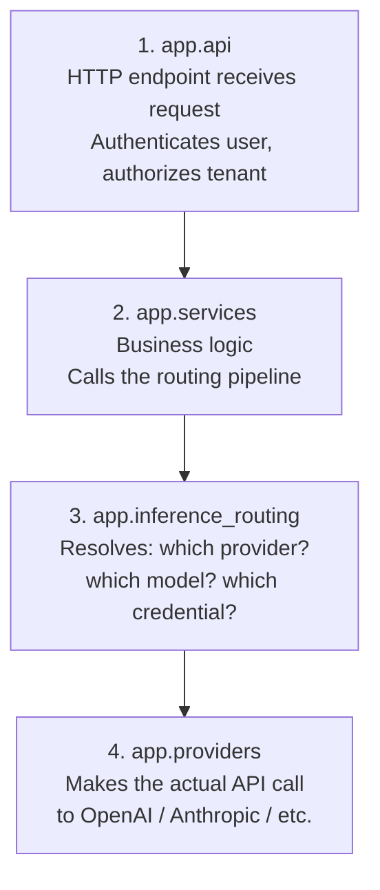
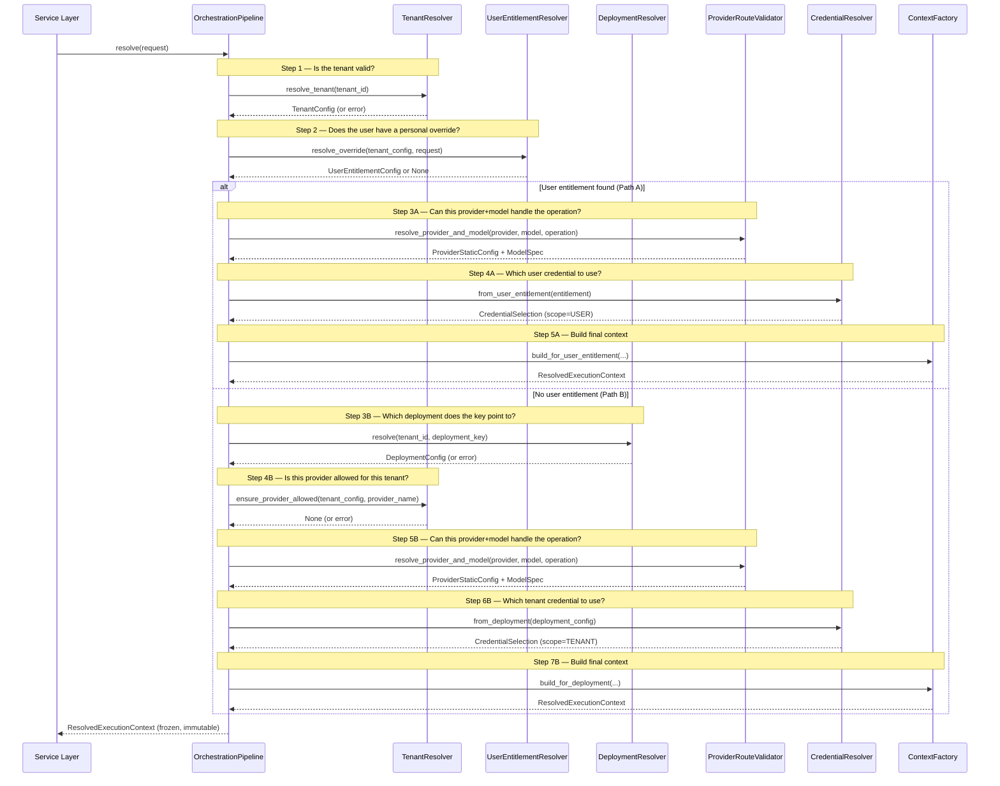

# Inference Routing — `app/inference_routing/`

> **Who this is for**: Anyone who needs to understand how an LLM request gets from an HTTP endpoint to an actual AI provider call. You don't need to know anything about this module beforehand — this document starts from zero.

---

## Table of Contents

1. [What problem does this package solve?](#1-what-problem-does-this-package-solve)
2. [Where does it fit in the application?](#2-where-does-it-fit-in-the-application)
3. [Step-by-step: what happens when a request arrives](#3-step-by-step-what-happens-when-a-request-arrives)
4. [Package structure — what lives in each file](#4-package-structure--what-lives-in-each-file)
5. [Class reference](#5-class-reference)
6. [Data contracts](#6-data-contracts)
7. [Exception taxonomy](#7-exception-taxonomy)
8. [Dependency rules](#8-dependency-rules)
9. [Enterprise patterns used](#9-enterprise-patterns-used)

---

## 1. What problem does this package solve?

**The situation**: A user sends a request to `/api/v1/llm/chat` with two headers: `X-Tenant-ID` and `X-Deployment-Key`. They want a chat completion. But between receiving that HTTP request and actually calling OpenAI (or Anthropic, or Azure, etc.), the application needs to answer several questions:

1. Is this tenant real and currently active? (Maybe they were suspended for non-payment.)
2. Does this user have a personal override that should be used instead of the tenant's default deployment?
3. Which deployment does the deployment key point to — and is that deployment currently active?
4. Is the provider (e.g., OpenAI) even allowed for this tenant?
5. Does the chosen model support the requested operation? (Not every model can do embeddings, for example.)
6. Which API key/credential should be used — the tenant's or the user's personal one?
7. What API endpoint URL do we call?

**What this package does**: It answers all seven questions in a single `resolve()` call and returns one frozen, read-only object that contains everything the downstream code needs to make the actual provider call. Nothing more, nothing less.

**What this package does NOT do**:

- It does **not** make HTTP calls to AI providers.
- It does **not** fetch actual passwords or API keys (only *references* to them).
- It does **not** know about HTTP status codes (it raises business-meaningful errors; another layer translates those to HTTP).
- It does **not** know about FastAPI, request headers, or JSON serialization.

Think of this package as the **routing brain**: it decides where the request should go and with what credentials, but it never actually *sends* the request.

---

## 2. Where does it fit in the application?

When an HTTP request arrives, it flows through four layers:



**Where inference_routing sits**: It is the third layer. The API layer authenticates the user. The service layer decides *what* to do. This package decides *how* to do it: which provider, which model, which credential, which endpoint.

**Important rule**: This package never imports from `app/api`, `app/services`, or `app/providers`. It only depends on `app/core` (shared exceptions and configuration models). This keeps it reusable — you could call it from a CLI script or a batch job without pulling in the web framework.

---

## 3. Step-by-step: what happens when a request arrives

### 3.1 The big picture (sequence diagram)

This diagram shows the **order of operations** when `OrchestrationPipeline.resolve()` runs. Each arrow is one method call. Read top to bottom.



### 3.2 The two paths explained in plain English

Every request takes one of two paths, determined at Step 2:

| Path | When it's chosen | What it means |
|---|---|---|
| **Path A — User Entitlement** | The user has a personal override for this deployment key | "This user has their own API key for this provider. Use their key and their settings instead of the tenant's." |
| **Path B — Tenant Deployment** | No user override exists | "Use the tenant's default deployment configuration and the tenant's API key." |

**Jargon explained**:
- **Entitlement**: A record that says "user X is allowed to use deployment Y on tenant Z, and here is the credential to use." Think of it as a personalized permission slip.
- **Deployment**: A tenant-level configuration that says "for deployment key `my-gpt4`, use OpenAI's `gpt-4o` model with these settings."
- **Resolution**: The process of turning abstract identifiers (tenant ID, deployment key) into concrete information (provider name, model name, API URL).

### 3.3 Precedence rule (which path wins?)

User entitlement **always wins over** tenant deployment — but only when all three conditions are true:

1. The user has at least one entitlement matching `(tenant_id, user_id, deployment_key)`.
2. That entitlement is marked as active.
3. The entitlement's provider is on the tenant's allow-list.

If **zero** entitlements match → fall through to tenant deployment path (Path B).

If **more than one** entitlement matches → `AmbiguousUserEntitlementError`. This is a data problem (someone created duplicate entitlements), not a routing problem. It means the system can't decide which one to use, so it refuses to guess.

---

## 4. Package structure — what lives in each file

```
app/inference_routing/
│
├── __init__.py               # Re-exports everything under one clean import path
│
├── pipeline.py               # OrchestrationPipeline — the single entry point
├── tenant_resolver.py        # TenantResolver — "is this tenant real and active?"
├── deployment_resolver.py    # DeploymentResolver — "what deployment does this key point to?"
├── entitlement_resolver.py   # UserEntitlementResolver — "does the user have a personal override?"
├── credential_resolver.py    # CredentialResolver — "which credential reference to use?"
├── provider_validator.py     # ProviderRouteValidator — "can this model do this operation?"
├── context_factory.py        # ResolvedExecutionContextFactory — assembles the final answer
│
├── models.py                 # Data shapes: ResolutionRequest, ResolvedExecutionContext, enums
├── contracts.py              # Interfaces (Protocols) for reading tenant/entitlement data
└── exceptions.py             # Errors specific to routing (ProviderNotAllowed, etc.)
```

Each file has **one clear job**. If you need to change how deployments are resolved, you only touch `deployment_resolver.py`. If you need to add a new routing error, you only touch `exceptions.py`. This is intentional — it keeps changes local and safe.

---

## 5. Class reference

### 5.1 `OrchestrationPipeline` — `pipeline.py`

**What it does**: The single entry point. Call `resolve()` with a `ResolutionRequest` and get back a `ResolvedExecutionContext`. It owns the order of operations — no other class knows what step comes next.

**Constructor dependencies** (all injected, one per step):

| Dependency | Job |
|---|---|
| `TenantResolver` | Step 1 — validate tenant |
| `UserEntitlementResolver` | Step 2 — check for user override |
| `DeploymentResolver` | Step 3B — resolve deployment from cache |
| `ProviderRouteValidator` | Step 3A/5B — validate provider+model+operation |
| `CredentialResolver` | Step 4A/6B — select credential reference |
| `ResolvedExecutionContextFactory` | Final step — assemble the result |

```python
class OrchestrationPipeline:
    def __init__(
        self,
        tenant_resolver: TenantResolver,
        entitlement_resolver: UserEntitlementResolver,
        deployment_resolver: DeploymentResolver,
        provider_validator: ProviderRouteValidator,
        credential_resolver: CredentialResolver,
        context_factory: ResolvedExecutionContextFactory,
    ) -> None: ...

    async def resolve(self, request: ResolutionRequest) -> ResolvedExecutionContext: ...
```

**Wiring**: Created once at application startup and stored on `app.state`. All requests share the same pipeline instance (it holds no per-request state).

---

### 5.2 `TenantResolver` — `tenant_resolver.py`

**What it does**: Answers two questions: (1) does this tenant exist and is it active? (2) is this provider on the tenant's allow-list?

```python
class TenantResolver:
    def __init__(self, tenant_reader: TenantConfigReader) -> None: ...

    async def resolve_tenant(self, tenant_id: UUID | str) -> TenantConfig: ...
    # Raises: TenantNotFoundError (tenant doesn't exist)
    #         TenantSuspendedError (tenant exists but is suspended)

    @staticmethod
    def ensure_provider_allowed(tenant_config: TenantConfig, provider_name: str) -> None: ...
    # Raises: ProviderNotAllowedError (provider not on tenant's allow-list)
```

`ensure_provider_allowed` is a **static method** — no database calls, no network I/O. The allow-list is already loaded in the `TenantConfig` object, so this check is instant.

---

### 5.3 `DeploymentResolver` — `deployment_resolver.py`

**What it does**: Looks up a deployment configuration from Redis using the tenant ID and deployment key. Also checks that the deployment is active.

```python
class DeploymentResolver:
    def __init__(self, cache: RedisCache) -> None: ...

    async def resolve(self, tenant_id: UUID | str, deployment_key: str) -> DeploymentConfig: ...
    # Raises: DeploymentNotFoundError (key not in Redis)
    #         ConfigurationError (data in Redis is corrupted)
    #         DeploymentInactiveError (deployment exists but is not active)
```

**Redis key it reads**: `tenant:{tenant_id}:deployments:{deployment_key}`

**Why Redis and not PostgreSQL?** Deployment configs are read on every inference request. Redis provides sub-millisecond reads. PostgreSQL would be too slow for this hot path. A separate config microservice pre-loads deployment data into Redis; this resolver only reads, never writes.

---

### 5.4 `UserEntitlementResolver` — `entitlement_resolver.py`

**What it does**: Checks whether the authenticated user has a personal entitlement (override) for this deployment key. If yes, validates it and returns the entitlement config. If no, returns `None` so the pipeline falls through to the tenant deployment path.

```python
class UserEntitlementResolver:
    def __init__(
        self,
        entitlement_reader: UserEntitlementReader,
        tenant_resolver: TenantResolver,
    ) -> None: ...

    async def resolve_override(
        self,
        tenant_config: TenantConfig,
        request: ResolutionRequest,
    ) -> UserEntitlementConfig | None: ...
    # Returns None → no override, use tenant deployment path
    # Returns one → user entitlement path wins
    # Raises AmbiguousUserEntitlementError → more than one match (data problem)
```

---

### 5.5 `ProviderRouteValidator` — `provider_validator.py`

**What it does**: Checks three things against the static YAML provider catalog: (1) is this provider configured? (2) does this model exist under this provider? (3) can this model handle the requested operation (chat/embed/rerank)?

```python
class ProviderRouteValidator:
    def __init__(self, config_loader: ConfigLoader) -> None: ...

    def resolve_provider_and_model(
        self,
        provider_name: str,
        model_name: str,
        operation: OperationType,
    ) -> tuple[ProviderStaticConfig, LLMModelSpec]: ...
    # Raises: ConfigurationError (provider YAML not found)
    #         ModelNotSupportedError (model not in provider's catalog)
    #         OperationNotSupportedError (model can't do this operation)
```

**This is the only synchronous class in the pipeline.** The YAML catalog is loaded into memory at startup — no I/O happens per request.

---

### 5.6 `CredentialResolver` — `credential_resolver.py`

**What it does**: Selects the right credential reference. Important: it returns a **reference** (like a key name), never the actual API key or password. The actual secret retrieval happens later, in the provider layer, right before the outbound API call.

```python
class CredentialResolver:
    @staticmethod
    def from_user_entitlement(entitlement: UserEntitlementConfig) -> CredentialSelection: ...
    # Returns credential with scope=USER

    @staticmethod
    def from_deployment(deployment: DeploymentConfig) -> CredentialSelection: ...
    # Returns credential with scope=TENANT
```

**Why separate credential fetching from routing?** Security. If routing code is ever compromised, the attacker gets credential references (useless without the secret store), not actual API keys. The blast radius is limited.

---

### 5.7 `ResolvedExecutionContextFactory` — `context_factory.py`

**What it does**: Takes all the resolved pieces (tenant config, provider config, model spec, credential selection) and assembles them into one frozen, immutable `ResolvedExecutionContext`. Also computes a route fingerprint (SHA-256 hash) used by the authorization cache.

```python
class ResolvedExecutionContextFactory:
    def build_for_deployment(self, *, tenant_config, deployment_config,
        provider_static_config, model_spec, credential_selection,
    ) -> ResolvedExecutionContext: ...

    def build_for_user_entitlement(self, *, tenant_config, user_entitlement_config,
        provider_static_config, model_spec, credential_selection,
    ) -> ResolvedExecutionContext: ...
```

**Parameter precedence** (which value wins when there are two sources):

| Parameter | Primary source | Fallback if primary is empty |
|---|---|---|
| Timeout (seconds) | Deployment config | Provider's default |
| Max retries | Deployment config | Provider's default |
| Temperature | Deployment config | *(required — no fallback)* |
| Max output tokens | Deployment config | Model's maximum |

For the user entitlement path, most parameters fall back to provider defaults since entitlements don't carry per-request limits.

---

## 6. Data contracts

### 6.1 `ResolutionRequest` — `models.py`

The input to the pipeline. Created from HTTP headers and the authenticated JWT payload.

| Field | Type | What it means |
|---|---|---|
| `tenant_id` | `UUID` | Which tenant is making this request (from `X-Tenant-ID` header) |
| `user_id` | `UUID` | Which user is authenticated (from JWT) |
| `deployment_key` | `str` | Which deployment to route to (from `X-Deployment-Key` header) |
| `operation` | `OperationType` | What kind of AI task: `CHAT`, `EMBED`, or `RERANK` |
| `requested_model_name` | `str \| None` | Optional hint for entitlement matching |

This model is **frozen** (immutable) — once created, it cannot be changed. This prevents bugs where one part of the pipeline accidentally modifies the input that another part depends on.

---

### 6.2 `ResolvedExecutionContext` — `models.py`

The output of the pipeline. The provider layer reads this to make the actual AI provider call.

| Key fields | Type | What it tells the provider layer |
|---|---|---|
| `provider_name` | `str` | e.g., `"openai"` |
| `model_name` | `str` | e.g., `"gpt-4o"` |
| `api_endpoint_url` | `str` | The full URL to call |
| `secret_reference` | `str` | Which credential to look up (not the key itself) |
| `credential_scope` | `USER` or `TENANT` | Whose credential to use |
| `effective_timeout_seconds` | `float` | How long to wait for the provider |
| `effective_max_retries` | `int` | How many times to retry on failure |
| `effective_temperature` | `float` | Creativity level for the model |
| `effective_max_tokens` | `int` | Max tokens the model can output |
| `resolution_source` | `USER_ENTITLEMENT` or `TENANT_DEPLOYMENT` | Which path won — useful for debugging |
| `route_fingerprint` | `str` | SHA-256 hash of the route — used by auth cache |

This model is also **frozen**. Once the pipeline produces it, nothing downstream can accidentally change it.

---

### 6.3 `CredentialSelection` — `credential_resolver.py`

A lightweight NamedTuple (not a full Pydantic model) used only inside the pipeline.

| Field | Type | Meaning |
|---|---|---|
| `credential_scope` | `USER` or `TENANT` | Whose credential |
| `secret_reference` | `str` | Opaque pointer into the secret store |
| `api_endpoint_url` | `str` | Provider's API URL |
| `cloud_region` | `str \| None` | Cloud region (for Bedrock, Azure) |

---

### 6.4 Reader Protocols — `contracts.py`

Two interfaces (Python `Protocol` classes) that define how resolvers read data **without knowing where the data lives**.

```python
class TenantConfigReader(Protocol):
    async def get_tenant_config(self, tenant_id: UUID | str) -> TenantConfig | None: ...

class UserEntitlementReader(Protocol):
    async def find_matching_entitlements(
        self, tenant_id, user_id, deployment_key, requested_model_name=None
    ) -> list[UserEntitlementConfig]: ...
```

**Why Protocols instead of concrete classes?** A `Protocol` says "I need something that has a `get_tenant_config` method" — it doesn't care whether that method reads from Redis, PostgreSQL, or a test mock. This means:

- Resolvers can be tested with simple in-memory stubs (no Redis needed in tests).
- The storage backend can be swapped (Redis → database) without changing any resolver code.
- The dependency direction is inverted: the resolver defines what it needs; the storage layer fulfills that contract.

---

## 7. Exception taxonomy

### 7.1 Errors raised by this package

All routing-specific errors inherit from `ResolutionError`, which inherits from `LLMServiceError` (the application-wide base error).

| Exception | Meaning | Raised by |
|---|---|---|
| `ProviderNotAllowedError` | This tenant is not allowed to use this provider | `TenantResolver` |
| `OperationNotSupportedError` | This model can't do chat/embed/rerank | `ProviderRouteValidator` |
| `AmbiguousUserEntitlementError` | User has multiple active entitlements for this route (data problem) | `UserEntitlementResolver` |

### 7.2 Errors re-used from `app/core/exceptions.py`

These errors are defined in the shared domain layer and re-used here:

| Exception | Meaning | Raised by |
|---|---|---|
| `TenantNotFoundError` | Tenant ID doesn't exist | `TenantResolver` |
| `TenantSuspendedError` | Tenant exists but is suspended | `TenantResolver` |
| `DeploymentNotFoundError` | Deployment key not found in cache | `DeploymentResolver` |
| `DeploymentInactiveError` | Deployment exists but is not active | `DeploymentResolver` |
| `ConfigurationError` | Provider YAML missing or cache data corrupt | `DeploymentResolver`, `ProviderRouteValidator` |
| `ModelNotSupportedError` | Model not found in provider's catalog | `ProviderRouteValidator` |

### 7.3 Who translates errors to HTTP status codes?

**Nobody in this package.** All errors propagate upward to `app/api/exception_handlers.py`, which owns the single mapping from error type → HTTP status code. This package has zero knowledge of HTTP — it only raises business-meaningful errors.

---

## 8. Dependency rules

What this package is **allowed** to import:

```
app/inference_routing/  may import from:
    app/core/            — shared exceptions, config models, domain enums
    app/schemas/         — OperationType enum
    app/infrastructure/  — RedisCache (only DeploymentResolver uses it)
```

What this package must **never** import:

```
app/inference_routing/  must NOT import from:
    app/api/             — no HTTP awareness
    app/services/        — no upward layer imports
    app/providers/       — this package resolves routes, doesn't make calls
    app/auth/            — authentication happened before this package runs
```

`DeploymentResolver` is the **only** class that takes an infrastructure dependency (`RedisCache`). All other classes depend on either pure domain models or Protocol interfaces that hide the data source.

---

## 9. Enterprise patterns used

| Pattern | Where | Why it matters |
|---|---|---|
| **Pipeline Orchestration** | `OrchestrationPipeline` | One entry point runs all steps in order. Adding a step means adding one line to `resolve()`. No other code changes. |
| **Protocol-based dependency inversion** | `contracts.py` | Resolvers depend on interfaces, not concrete storage classes. Test with mocks, swap backends without touching resolver code. |
| **Immutable (frozen) models** | `ResolutionRequest`, `ResolvedExecutionContext` | Once created, cannot change. Prevents async bugs where one coroutine mutates state another coroutine is reading. |
| **Factory pattern** | `ResolvedExecutionContextFactory` | Centralizes assembly of the final context from 5+ sources. Guarantees consistency. |
| **Credential reference pattern** | `CredentialResolver` | Returns pointers to secrets, never the secrets themselves. Routing layer has zero access to plaintext credentials. |
| **Cache-first resolution** | `DeploymentResolver` | Reads from Redis (sub-millisecond) instead of PostgreSQL. Hot-path optimization for inference requests. |
| **Static (no-I/O) validation** | `ProviderRouteValidator`, `TenantResolver.ensure_provider_allowed` | Configs loaded once at startup. Per-request validation is pure CPU work — no network calls, no database queries. |
| **Canonical exception surface** | `exceptions.py` + `app/core/exceptions.py` | Errors mean exactly one thing. No re-mapping, no re-wrapping. The API layer translates them to HTTP in one place. |
| **TYPE_CHECKING guards** | All files | Prevents circular imports. Runtime annotations are strings; type checker resolves them fully. |
| **Single-responsibility files** | One class per file | Change deployment logic → only touch `deployment_resolver.py`. Never risk breaking unrelated code. |

---

> **Author**: Shubham Singh
