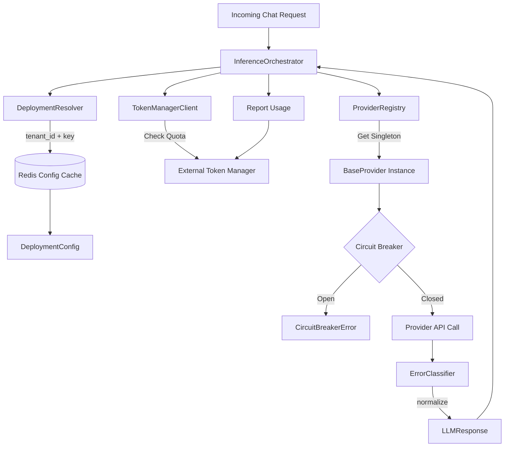

# LLM Gateway Migration Walkthrough

The transition of the legacy LLM gateway to a high-performance, asynchronous, and resilient architecture is complete. We've replaced the synchronous, Celery-backed provider execution flow with a modern `asyncio`-driven, Redis-backed orchestrated pipeline.

## 1. Enterprise Pattern Architecture

The execution pipeline has been restructured into an explicit orchestration flow that supports scaling and multi-tenant routing:

## 2. Infrastructure Layer

> [!NOTE]
> All infrastructure components leverage `redis.asyncio` and `httpx.AsyncClient` for high concurrency without thread blocking.

- **`circuit_breaker.py`**: Added `aiobreaker` integrated with our central `RedisCache`. This ensures that if OpenAI starts failing, the circuit breaker opens across *all* worker nodes simultaneously, preventing cascading failures.
- **`http_client_factory.py`**: Implements global HTTP connection pooling. Instead of creating a new session per request, providers reuse HTTP transports, significantly reducing TLS handshake overhead.

## 3. Provider Layer

> [!IMPORTANT]
> The Provider architecture uses the Template Method pattern to enforce strict bounds and standardization.

- **`base_provider.py`**: The abstract base class. It enforces the circuit breaker wrap on all public methods (`generate`, `embed`, etc.). Concrete providers only need to implement the internal methods (`_generate`, `_embed`).
- **`error_classifier.py`**: Centralized exception normalization. Raw `httpx.HTTPStatusError` or `botocore.exceptions.ClientError` are mapped to our internal `ProviderError` hierarchy here, eliminating duplicate error-handling blocks in each provider.
- **Provider Subclasses**: `openai_provider.py`, `anthropic_provider.py`, `bedrock_provider.py`, etc., were stripped of redundant error mapping logic and refactored to conform to the new `_generate` internal methods.
- **`registry.py`**: The singleton cache mapping `(tenant_id, deployment_id)` to a concrete provider instance. It guarantees that secrets are never stored inside instances, maintaining long-term security.

## 4. Service Layer Orchestration

We introduced three core service components:

- **`deployment_resolver.py`**: Asynchronously looks up runtime tenant configurations from Redis using the key pattern `tenant:{tenant_id}:deployments:{deployment_key}`. 
- **`token_manager_client.py`**: A placeholder client ready to communicate with the external Token Manager microservice for quota enforcement and usage reporting.
- **`inference_orchestrator.py`**: The glue. This acts as the single point of entry for the application layer. It takes a raw request, resolves the config, checks quota, fetches the provider, executes the request, and reports usage back.

## 5. Security Improvements

> [!WARNING]
> Secrets are no longer long-lived!

Previously, credentials might be loaded and held in class state. Now, the `DeploymentConfig` stores only a `secret_reference`. The API key is injected directly into the `request` frame right before execution and is dropped immediately afterward.

## 6. Next Steps
- Integrate the `InferenceOrchestrator` into the FastAPI HTTP routes.
- Connect the `TokenManagerClient` to the real gRPC/HTTP endpoints of the Token Manager microservice.
- Complete the Postgres fallback in `ConfigLoader` for when the Redis cache misses.
